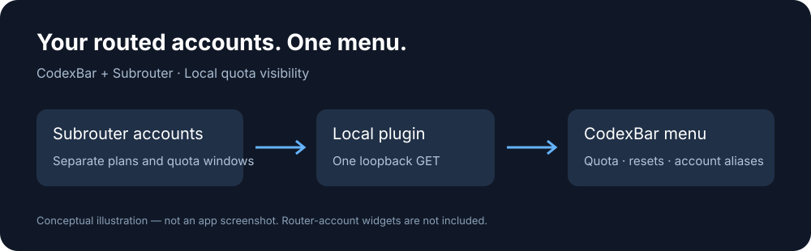

# Codex Quota Bar

[Product website / 产品展示](https://codex-quota-bar.sheyajane.chatgpt.site/) · [Maintainer / 作者](https://github.com/DeepCogNeural)

> **Native integration:** two text-free quota bars, plan-priority ordering and a manual new-chat account selector are available as a local source integration. See [build and acceptance notes](integrations/README.md). The v0.1.0 plugin download remains read-only.


**See the Codex accounts in your router, together in your Mac menu bar.**

A small local [CodexBar](https://github.com/steipete/CodexBar) provider plugin for [Subrouter](https://github.com/manaflow-ai/subrouter). Display remaining subscription quota, reset estimates, account aliases and login status without importing your router's OAuth tokens into another tool.

[简体中文](README.zh-CN.md) · [Install](#install) · [Compatibility](#compatibility-and-limits) · [Architecture](docs/architecture.md) · [Agent guide](llms.txt)



> **Experimental v0.1.0.** The menu integration has been exercised with two local accounts. Router-account widgets are not implemented. This plugin displays usage; Subrouter remains responsible for routing.

## Why use it?

If you already route Codex requests across multiple ChatGPT subscriptions, the account shown in a client is not always enough to understand your available quota. This plugin reads the account pool directly from your local router.

- **One card, separate accounts.** Keep short-window and weekly percentages attached to the account that owns them. No misleading total across different subscription plans.
- **Keep authentication in Subrouter.** The plugin declares no secrets or browser-cookie access and never opens OAuth files.
- **Use your existing menu bar app.** One JavaScript file; no fork, application patch, extra background daemon or build toolchain.
- **Readable identity.** Optional aliases stay in local CodexBar settings. Login status and missing quota are distinct states.
- **Visible network access.** One loopback GET endpoint, approved through CodexBar's normal plugin flow.

## Native macOS UI highlights

The optional [native source integration](integrations/README.md) adds a compact, macOS-style quota panel: system typography, restrained spacing, rounded progress tracks and appearance-aware gray outlines that distinguish white quota fills from light backgrounds. The outline change was built and installed locally; light/dark pixel-level acceptance is still pending because screenshot access was unavailable.

- **Quiet at a glance:** two text-free menu-bar tracks; account names and reset details stay in the panel.
- **Useful hierarchy:** higher subscription tiers stay above Plus; selecting an account does not reshuffle the list.
- **5h first for Plus:** click the quota row to alternate 5h / Weekly without another button. Each account remembers its choice. See the interaction acceptance limits in the integration notes.
- **Intentional control:** choose Automatic or a manual account for new chats; existing conversation assignments remain with the router.

### Choose your installation

| Need | Choose |
| --- | --- |
| Read multiple accounts with an existing CodexBar installation | [Released JavaScript plugin](#install) |
| Native progress bars and manual new-chat account selection | [Source integration and build instructions](integrations/README.md) |

### Common questions

**Can I monitor multiple ChatGPT Plus / Pro subscriptions on macOS?** Yes, when those Codex accounts are enrolled in a compatible local Subrouter. This is a Codex subscription quota monitor, not a general ChatGPT message counter.

**Is this a new router or a replacement for CodexBar?** Neither. It integrates both upstream projects and adds quota presentation plus optional local routing controls.

**Does selecting an account move my current conversation?** No. The native selector changes the new-chat default. It does not identify or migrate the foreground conversation.

**Does it manage Claude or Antigravity accounts?** Those remain separate CodexBar providers. This integration reads Codex accounts from Subrouter.

## Install

### Prerequisites

- macOS 14 or later, with [CodexBar](https://github.com/steipete/CodexBar/releases) installed. The local acceptance run used **0.56.7**.
- An existing [Subrouter](https://github.com/manaflow-ai/subrouter) installation with enrolled accounts, serving at `http://127.0.0.1:31415`. The acceptance run used **0.1.130**.

This repository does not install the router, enroll accounts, or change Codex routing settings.

### Add the plugin

1. Download `subrouter.js` from the [v0.1.0 release](https://github.com/DeepCogNeural/codex-quota-bar/releases/tag/v0.1.0).
2. In CodexBar, open **Settings → Plugins → Install plugin**, then choose the downloaded file.
3. Set **Router URL** to `http://127.0.0.1:31415`. Leave **Account aliases (JSON)** blank, or enter your own mapping, for example:

   ```json
   {"first@example.com":"Personal", "second@example.com":"Work"}
   ```

4. Review the request: **Auth: none**, **Secrets: none**, origin `http://127.0.0.1:31415`. Type that origin into the confirmation field and approve.
5. Enable **Subrouter**, then choose **Refresh**.

You can also copy the reviewed file to `~/.config/codexbar/providers/subrouter.js` and restart CodexBar, then use **Approve…** in Settings. Do not replace your complete CodexBar configuration or copy another person's approval file.

### Read the card

- Percentages in the account detail rows are **remaining**, not consumed.
- `5h` and `7d` identify the length of the quota window.
- Reset timestamps are estimated from the router response and displayed as UTC ISO timestamps in this initial plugin.
- `✓` means the router checked authentication and reported it valid; `!` means invalid; `?` means not yet checked.
- `—` means unavailable, not zero. Login status does not prove a model request will succeed.

For the host interface, select **Settings → General → Language → System** to follow macOS. Restart CodexBar after changing language preferences. Plugin setting names and error messages currently remain English; the account rows use names, numbers and symbols.

## Compatibility and limits

| Capability | This release |
| --- | --- |
| Multiple Subrouter Codex accounts in the menu | Yes; two accounts exercised locally |
| Base short-window and weekly limits | Yes, when returned by the router |
| Model-specific quota windows | Excluded (`Feature` windows) |
| Router account widgets | **No**; CodexBar excludes local plugins from widgets |
| Claude / Antigravity | Use CodexBar's separate built-in providers; not fetched by this plugin |
| Automatic account routing or failover | Owned by Subrouter, not implemented or guaranteed here |
| Current conversation's actual account | Not displayed |
| Custom port / remote router | Not supported in v0.1.0 |
| Scale | Up to eight accounts, eight base windows per account |

CodexBar's built-in Claude and Antigravity widgets do not imply that this plugin's router accounts can appear in a widget. See [upstream plugin limitations](https://github.com/steipete/CodexBar/blob/v0.56.7/docs/plugins.md#security-and-limitations).

## Troubleshooting

**Needs approval:** open the plugin settings and approve the exact local origin. Changing network authority requires approval again.

**No accounts / cannot connect:** confirm Subrouter is running on the documented port and has enrolled accounts. Do not paste OAuth tokens into plugin settings.

**Missing bars:** the current CodexBar generic plugin card displays account detail rows. The plugin also returns named quota windows, but the host decides how to render them.

**Data looks old:** refresh the plugin and check for a fetch error. A previously rendered number is not proof of a successful refresh.

**Other provider errors:** configure or disable those built-in providers separately; they do not come from the Subrouter plugin.

## Remove

Use **Settings → Plugins → Delete…** for Subrouter. This removes the plugin through CodexBar's normal flow. It does not stop Subrouter, remove its accounts, or alter your Codex client configuration.

## Project scope and credits

This is an independent integration, not a renamed CodexBar fork or a new routing engine. CodexBar supplies the menu, plugin runtime, language settings and refresh lifecycle. Subrouter supplies authentication, quota collection and routing. This repository supplies the response mapping, optional native quota UI, local routing-policy integration and installation guidance. Neither upstream project's source or binary is bundled here.

Next: clearer reset formatting and a native path for router-account widgets. These are roadmap items, not shipped features. See [validation notes](docs/validation.md).

## Support the project

If this saves you time, consider [starring the repository](https://github.com/DeepCogNeural/codex-quota-bar). Stars are optional. Explore more work by [DeepCogNeural](https://github.com/DeepCogNeural). Bug reports with sanitized examples and tested compatibility reports are also welcome.

MIT licensed. Independent of OpenAI, Anthropic, Google, CodexBar and Subrouter.
