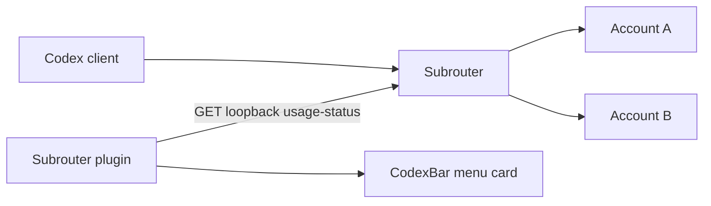

# Architecture

The request path and display path are separate. Installing this plugin does not change the client's base URL or move conversations between accounts.

## Ownership

| Component | Owns |
| --- | --- |
| Subrouter | Account credentials, usage collection, request routing and session behavior |
| This plugin | Validating and mapping account/window JSON into a generic snapshot |
| CodexBar | Plugin permissions, HTTP runtime, menu rendering, refresh schedule and main UI localization |

The plugin expects a top-level account array with email, auth_checked, auth_valid, plan_type and windows. Windows use UsedPercent, LimitWindowSeconds, ResetAfterSeconds and optional Feature. Only base windows are included. Each account remains distinct; the adapter does not select a preferred account or synthesize an aggregate.

The only request is GET http://127.0.0.1:31415/_subrouter/usage-status. There is no auth declaration and no cookie capability. The host rejects redirects and bounds plugin responses under its own runtime policy. The router may update internal quota scores when serving this GET; the plugin makes no explicit routing mutation. Host-managed polling therefore is not a claim that the server has zero internal side effects.

Aliases are optional plain local settings. The source file contains no personal accounts. The host controls cached error behavior. Reset estimates are calculated at response receipt and can inherit upstream cache age.

## Widget boundary

Upstream v0.56.7 excludes user plugins from WidgetKit snapshots. Enabling a plugin does not enable a widget. A future native integration would need to carry account identities and windows through the host snapshot and widget picker without replacing the built-in Codex provider or leaking account data across providers.

Keep that future work separate from this small plugin release. Do not write directly into the upstream app-group widget cache as a workaround.

## Optional native integration

The `integrations/` sources add an opt-in view to the existing CodexBar status item. A GET/POST local control endpoint stores the new-chat default in Subrouter. A dedicated private token authorizes changes. Existing session assignments remain unchanged; sessions created in manual mode persist a strict account pin and reuse upstream forced routing. Returning the default to automatic does not remove those pins. The checkmark identifies the new-chat default, not the account of an arbitrary foreground conversation.

In quota-only mode, the status item opens a native panel with an AppKit account dropdown; it does not embed another tracking menu inside NSMenu. The host retains its existing provider integrations and settings. Plan priority controls visual order only, never the automatic scheduler. See `integrations/README.md` for the source revisions, build constraints and acceptance status.
